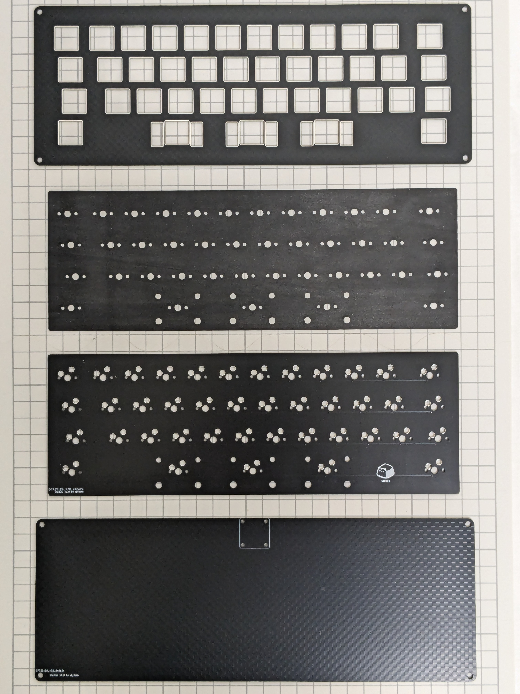

# Slab40ビルドガイド

## 1. はじめに

本書は自作キーボードであるSlab40のビルドガイドです。キーボードとして利用可能になるまでの手順を初心者向けに丁寧に記載したつもりですが、不明な個所などある場合は適時検索するなどして補ってください。

申し訳ないのですがSlab40固有でない一般のご質問にはお答えできません。各自お調べください。

## 2. 準備

### 2.1 内容物確認

Slab40は本体となる基板とキースイッチ固定用のトッププレート、底面を支えるボトムプレートのセットです。キーボードとして使用するにはその他必要な部品を別途調達いただく必要があります。

|品目|数量|
|---|---|
|Slab40 トッププレート|1|
|Slab40 スイッチフォーム|1|
|Slab40 基板|1|
|Slab40 ボトムプレート|1|
|M2ナット|4|
|M2ネジ 4mm|4|
|M3ネジ 5mm|8|
|M3スペーサー 10mm|4|
|M3シリコンワッシャー 1mm|8|

> [!NOTE]
> 基板に「Slab30」と印字されたロットがありますが、これは旧称でありSlab40と同一品ですのでご安心ください。

### 2.2 別途用意が必要な部品

下記部品は国内外の自作キーボード専門店や電子部品販売店などから別途調達してください。

|品目|数量|備考|
|---|---|---|
|Waveshare RP2040-Tiny|1|[Waveshare製RP2040-Tiny 純正品](https://www.waveshare.com/wiki/RP2040-Tiny)をお勧めします|
|1N4148W ダイオード (SOD123)|41|[Diodes Incorporated社製1N4148W](https://www.diodes.com/part/view/1N4148W)もしくはその同等品|
|MX互換スイッチソケット|41|[Kailh PCB Socket CPG151101S11](https://www.kailhswitch.com/mechanical-keyboard-switches/box-switches/mechanical-keyboard-switches-kailh-pcb-socket.html)もしくはその互換品|
|MX互換キースイッチ|41|[Cherry MX](https://www.cherrymx.de/en/dev.html)もしくはその互換品|
|MX互換キーキャップ|必要数|[Cherry MX](https://www.cherrymx.de/en/dev.html)もしくはその互換品|
|2uサイズPCBマウント型スタビライザー|3|幅の広いキーの押し下げを安定させる部品です。最下段の2u、2.75u、2uキーに必要です|

### 必要なキーキャップとサイズ

下図の通りのサイズのキーキャップが必要です。一般的なキーキャップセットには含まれないサイズがありますので、キーキャップをご購入の際はご注意ください。特に下記サイズは標準的なキーキャップセットに加えて別途40%用のキーキャップセットを入手する必要があります。

|行|サイズ|初期レイアウトの対応キー名|
|---|---|---|
|R1| - |※R1行は本キーボードにはありません。最上段はR2行となります|
|R2|1.25u|Tabキー|
|R2|1.75u|Backspaceキー|
|R3|1.5u|Enterキー|
|R4|2u x 2|スペースキー|

キーの印字はただの飾りですので、同じサイズのキーキャップであれば異なる印字でも代替可能です。

[KBDfansのPBDfans 40'sシリーズ](https://kbdfans.com/collections/keycaps/products/pbtfans-40s-kit-collection)には必要なキーが揃っていることが多いのでお勧めです。

> [!WARNING]
> PBDfans 40'sシリーズすべての製品について適合することを保障するものではありません。必ずご自身で内容物を確認してください。

### 2.3 道具

以下の道具が必要です。

|品目|数量|備考|
|---|---|---|
|はんだごて、はんだ|1|ダイオードやスイッチソケットのはんだ付けに用います|
|ピンセット|1|はんだ付けの際にあると便利です|
|ねじ回し（プラス）|1|基板とボトムプレート（もしくはケース）を固定する際に用います|

以下の道具は、あると便利なものです。

|品目|数量|備考|
|---|---|---|
|拡大鏡|1|ダイオードの向きを確認する際にあると便利です|
|テスター|1|ダイオードの導通を確認する際にあると便利です|

## 3. ファームウェアの書き込み

まず初めにRP2040-Tinyの動作確認と、ファームウェアの書き込みを行います。

## 3.1 ファームウェアのダウンロード

下記からファームウェアをダウンロードしてください。

https://github.com/ymkn/Slab40/releases/download/v1.0/ymkn_slab40_vial.uf2

## 3.2 RP2040-Tinyの動作確認とファームウェアの書き込み

まず、RP2040-Tinyのメインボードとアダプタボードを付属のフラットケーブルで接続します。その後、お使いのコンピュータのUSB 2.0以上に対応したUSBコネクタと、RP2040-Tinyを接続してください。RP2040-Tinyが正常であれば、`RPI-RP2`というドライブがマウントされると思います。

> [!WARNING]
> フラットケーブルを固定するためのコネクタカバーは非常に繊細です。誤って折ってしまわないように注意してください。また、フラットケーブルは青色が表側です。端子は裏側にのみ露出しています。コネクタ接続の際は表裏を間違えないように注意してください。

もしマウントされない場合は、メインボードとアダプタボードが正しく接続されているか確認し、他のUSB機器を取り外してもう一度試してください。加えて、USBケーブルを接続した状態のままRP2040-TinyのBOOTボタンを押しながらRESETボタンを押してください。これらの操作で`RPI-RP2`というドライブがマウントされれば問題ありません。もしこれでも何も起きない場合、RP2040-Tinyが壊れている可能性があります。。。

> [!NOTE]
> 他のRP2040使用機器が接続済みの場合、うまくRPI-RP2ドライブがマウントされない事象を確認しています。

この`RPI-RP2`というドライブに、先ほどダウンロードしたファームウェアをコピーしてください。しばらくすると`RPI-RP2`ドライブが消えますので、これでファームウェアの書き込みは完了です。USBケーブルを抜いてください。

その後、RP2040-Tinyのメインボードとアダプタボードからフラットケーブルを取り外し、コネクタを閉じておいてください。ケーブルが繋がったままだと組み立てしにくく、破損の原因にもなります。

> [!NOTE]
> 何らかの理由でやり直したい場合は、RP2040-TinyのBOOTボタンを押しながらRESETボタンを押すことで、再び`RPI-RP2`というドライブをマウントすることができます。

## 4. 組み立て

### 4.1 はんだ付け

はんだ付けが必要な部品はダイオード、スイッチソケット、RP2040-Tinyです。下記写真の通り、すべて基板裏面（ロゴのついていない方）にはんだ付けしますので間違えないように注意してください。

#### 4.1.1 ダイオードのはんだ付け

「コ」の字状のガイドが白線でキー数分印刷されていますので、そのすべてにダイオードをはんだ付けします。

> [!WARNING]
> ダイオードは向きが決まっています。ダイオード上の目印が印刷されている側（カソード側）が向かって右側になるようにしてください。まず片足だけをはんだ付けした状態でテスター等を使い導通確認をすると、向きが間違っていても直しやすく安心です。

すべてのダイオードが基板に密着しており、両端とも漏れなくはんだ付けされているか確認してください。基板から浮いていたり、はんだ付けができていないとキースイッチの動作不良の原因になります。

#### 4.1.2 スイッチソケットのはんだ付け

L字状のガイドが白線でキー数分印刷されていますので、そのすべてにスイッチソケットをはんだ付けします。

すべてのスイッチソケットが基板に密着しており、ソケット両端とも漏れなくはんだ付けされているか確認してください。基板から浮いていたり、はんだ付けができていないとキースイッチの動作不良の原因になります。

#### 4.1.3 RP2040-Tinyメインボードのはんだ付け

基板裏面右下のパッドにあわせてRP2040-Tinyメインボードを直接置き、はんだ付けをしてください。RP2040-Tinyのパッケージにピンヘッダが同梱されていたかもしれませんが、Slab40ではピンヘッダを使いません。

マスキングテープで固定してからはんだ付けするとズレずに済みます。

### 4.2 スイッチパッドとスタビライザーの取り付け

この段階でスイッチパッドを基板の**表面**に設置してください。穴の位置を合わせて単純に載せるだけで良いです。この上からスタビライザーやスイッチを取り付けることで固定します。

スタビライザーは基板の**表面**（ロゴが印刷されている面）に取り付けます。取り付け方はスタビライザーごとに異なりますが、一般には大きい穴の方にツメを引っかけ、小さい穴の方にプッシュピンを差し込む、もしくはネジ留めを行います。

### 4.3 スイッチとトッププレートの取り付け

キースイッチはトッププレートを通して基板のソケットに差し込みます。すべてのキースイッチを一度に取り付けてしまうと基板に差し込むのが大変なので、まずトッププレートの四隅にキースイッチを取り付けて基板に差し込み、その後残りのスイッチを取り付けていくのがおすすめです。

### 4.4 RP2040-Tinyアダプタボードの取り付け

ボトムプレート上の四角にガイドされている位置に、RP2040-Tinyアダプタボードを取り付けます。ボトムプレートの**下側**からアダプタボード四隅の穴をネジで通し、ナットで締め付けます。

### 4.5 RP2040-Tinyメインボードとアダプタボードの接続

まずRP2040-Tinyアダプタボード側にフラットケーブルを接続し、次に基板の向きをボトムプレートやケースへの取り付け方向に合わせてから、フラットケーブルをメインボード側に接続してください。

フラットケーブルは多少曲げたり折ったりしても問題ありませんが、過度にねじれたりしないようにしないようにしてください。

### 4.6 基板の取り付け

ボトムプレート、基板、スイッチプレートの順に重なる形で、ボトムプレートとスイッチプレートの間、四隅にスペーサーを取り付けます。このとき、スペーサーとプレートの間にワッシャーを挟んだ状態で取り付けてください。

このときネジを固く締め過ぎてしまうと、シリコンワッシャーが潰れて打鍵感が固くなってしまいますので、甘めに締めるようにしてください。

なお、固い打鍵感がお好みの場合はシリコンワッシャーを取り付けず、スペーサーのみを取り付けてください。

### 4.7 キーキャップの取り付け

全てのスイッチにお好みのキーキャップを取り付けてください。これで完成です。

## 5. 使用

### 5.1 動作確認

コンピュータとSlab40をUSBケーブル接続し、文字が入力できることを確認してください。

### 5.2 キーマップのカスタマイズ

本キーボードは[Vial](https://get.vial.today/)というキーマップ変更ツールに対応しています。Vialの詳しい使いかたはVialのドキュメントや世間の情報を参考にしてください。

> [!TIP]
> 何らかの理由で既定のレイアウトに戻したい場合は、本書末尾記載の「ブートモードの入り方」に従いブートモードに入った後、再度USBケーブルを抜き差ししてください（この時はどのキーも押す必要はありません）。

### 5.3 ケースデータについて

Slab40専用ケースであるHenge40ケースの3Dデータを公開しています。金属素材のCNC削り出しが可能なサービスで製造が可能です。

- https://github.com/ymkn/KeeBar/releases/download/v1.0/Henge40-Enclosure-Case.step (ケース3Dデータ)
- https://github.com/ymkn/KeeBar/releases/download/v1.0/Henge40-Enclosure-Case.pdf (ケースネジ穴指示)
- https://github.com/ymkn/KeeBar/releases/download/v1.0/Henge40-Enclosure-Cover.step (カバー3Dデータ)
- https://github.com/ymkn/KeeBar/releases/download/v1.0/Henge40-Enclosure-Cover.pdf (カバーネジ穴指示)

> [!CAUTION]
> 3Dプリンタによる出力は設計上考慮されていません。ネジ穴の造形に問題が生じたり、素材の収縮によりケースとカバーがかみ合わなくなるなどの問題が発生する恐れがあります。

追加で下記部品の調達が必要です。

|品目|数量|
|---|---|
|ケースカバー固定用 M2ネジ 4mm |4|
|マウント用クッション材 3mm厚（PORON等。片面粘着テープ付き）|適量|

マウント用のクッション材はプレートの端四方、**表裏両方**に貼り付けてください。Henge40ケースの段差の部分に乗るように、おおよそ4mm程度の細さにカットすると良いです。長さは適当で構いません。

もし打鍵時にカタカタ言うようであれば、プレート側面にもクッション材を挟んでプレートが動かないように固定してください。

## 6. その他

### 6.1 ブートモードの入り方

RP2040のブートモードに入るには、左上のキー（Tabキー）を押しながらUSBケーブルを接続します。

もしくは、RP2040-TinyのBOOTボタンを押しながらRESETボタンを押します。

### 6.2 ソースコード/設計データのありか

本リポジトリ内で公開しています。MITライセンスです。

https://github.com/ymkn/Slab40
